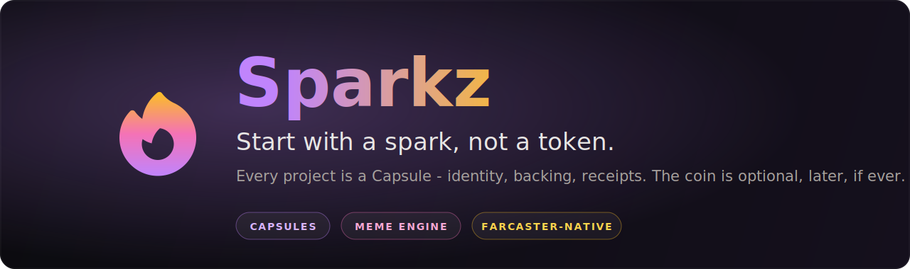
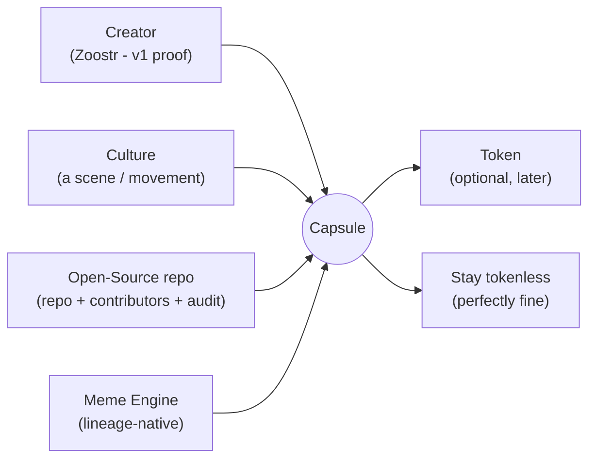
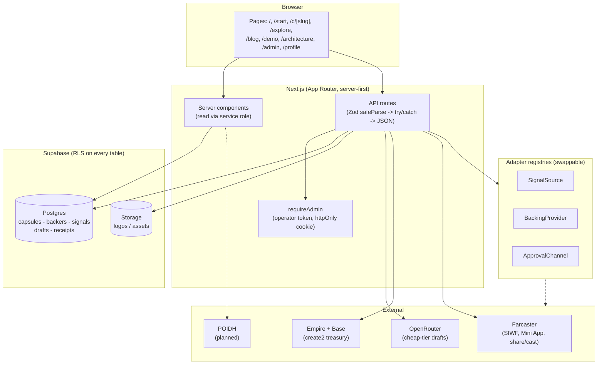
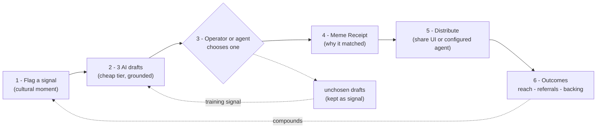
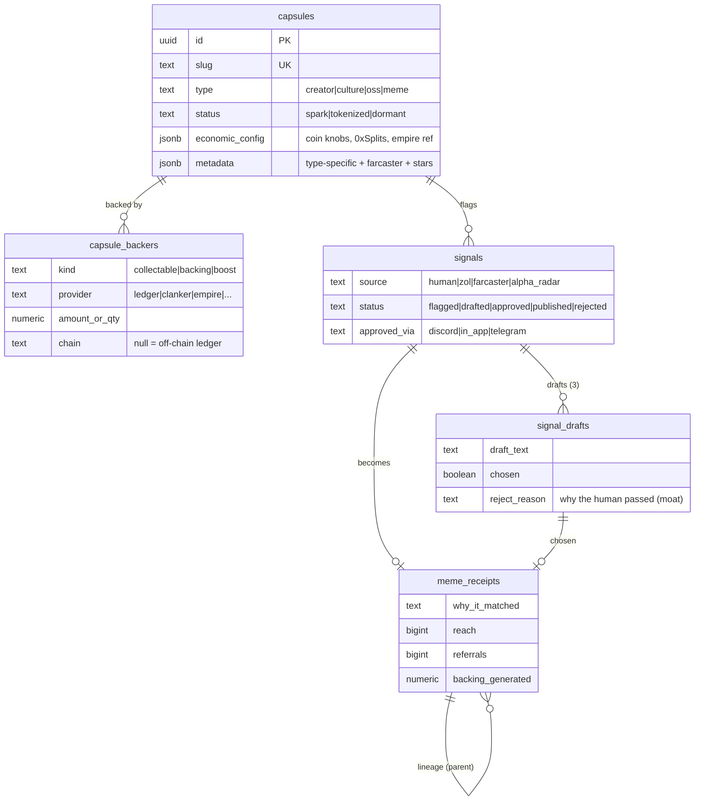
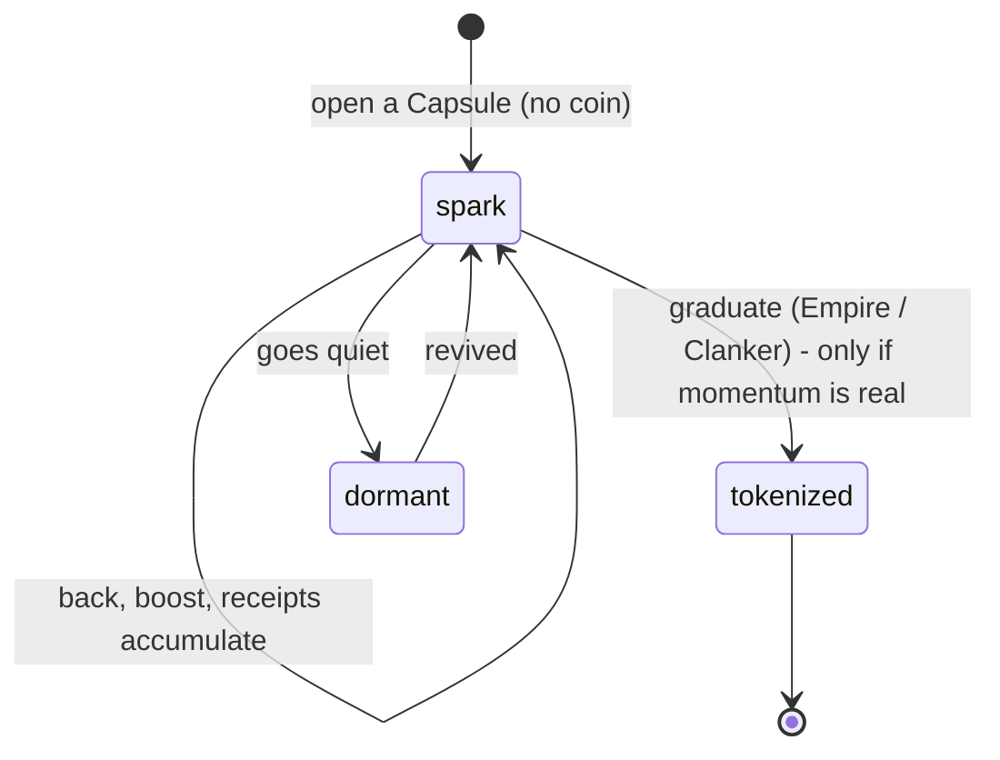
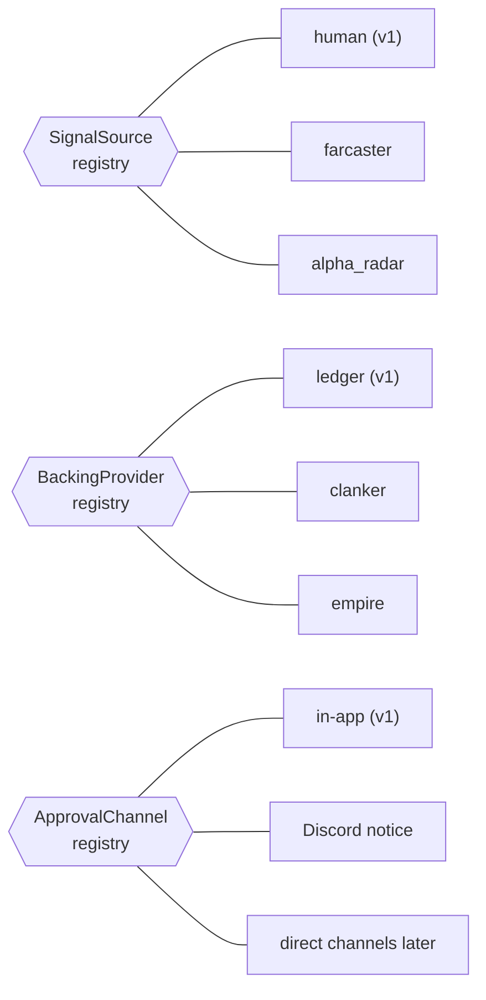

<p align="center">
  
</p>

<p align="center">
  <a href="https://trysparkz.com">trysparkz.com</a>
  -
  <a href="#the-meme-engine-loop">The loop</a>
  -
  <a href="#data-model--the-moat">The moat</a>
  -
  <a href="#pages">Pages</a>
  -
  <a href="#api-reference">API</a>
  -
  <a href="#local-setup">Setup</a>
  -
  <a href="#documentation">Docs</a>
</p>

<p align="center">
  
  
  
  
  
</p>

<p align="center">
  <a href="https://trysparkz.com/architecture"></a>
</p>

---

**Sparkz lets a creator start with a spark, not a token.** Build community and momentum first - visible support, receipts, and a record that compounds - and launch a token only if and when it makes sense. No token required to get started. Back the album, not buy a coin.

> **TL;DR** Every section below opens with a one-line TL;DR, so you can skim the whole thing top to bottom in a minute. Read the bold lines; dive into any section that catches you.

## New here? Start with this

> **TL;DR** Sparkz is for creators, no code needed. Open a Capsule, build real backing first, tokenize later if ever.

**Sparkz is for creators - artists, musicians, writers, builders - and the people around them. You do not need to code to use it, or to help.**

Here is the whole idea in plain words: instead of launching a coin on day one and hoping people trade it, you open a **Capsule** - a home for your project that holds your identity, the people backing you, and a record of everything you have made. You build real support first. A token is optional, and only later, if it ever makes sense.

<p align="center">
  <a href="https://trysparkz.com"></a>
  &nbsp;
  <a href="https://trysparkz.com/demo"></a>
</p>

- **Support** - people can boost your work without buying a token or connecting a wallet.
- **Connect** - your project gets a Farcaster home and a community that shows up.
- **Build** - turn a relevant moment into a publish-ready post and a permanent record.

<!-- DEMO GIF SLOT: record a 20-30s screen capture of the loop on trysparkz.com
     (open a Capsule -> boost -> Meme Engine drafts -> approve -> receipt -> share), save it as
     docs/assets/demo.gif, and replace this comment with:
     <p align="center"></p> -->

Not sure what a word means? Every coined term is defined in plain English in the [Glossary](#glossary). Want to help without writing code? See [Contribute without coding](CONTRIBUTING.md#contribute-without-coding).

## Contents

> **TL;DR** Jump straight to the idea, the product, the implementation, or the open questions.

- [New here? Start with this](#new-here-start-with-this)
- [Glossary](#glossary)
- [The idea](#the-idea)
- [Why it's different](#why-its-different)
- [No lock-in, by design](#no-lock-in-by-design)
- [How Sparkz compares](#how-sparkz-compares)
- [The Capsule](#the-capsule)
- [Architecture](#architecture)
- [The Meme Engine loop](#the-meme-engine-loop)
- [Data model / the moat](#data-model--the-moat)
- [Adapter seams](#adapter-seams)
- [Integrations](#integrations)
- [Pages](#pages)
- [API reference](#api-reference)
- [Tech stack](#tech-stack)
- [Repo layout](#repo-layout)
- [Local setup](#local-setup)
- [Deploy](#deploy)
- [Security](#security)
- [The four anti-failure gates](#the-four-anti-failure-gates)
- [Roadmap](#roadmap)
- [Still fluid - help us decide](#still-fluid---help-us-decide)
- [Documentation](#documentation)
- [Principles](#principles)
- [Provenance](#provenance)

## Glossary

> **TL;DR** Every coined word on this page, in plain English - start here if a term trips you up.

Plain-language definitions. If a coined word shows up anywhere and you are not sure what it means, it is here.

| Term | In plain words |
| --- | --- |
| **Spark** | A project before it is a coin. You start here. |
| **Capsule** | Your project's home base on Sparkz - its identity, its backers, and a record of what it has made. Not a coin. |
| **Back / Boost** | To support a creator you believe in. Free - no wallet, no coin required. |
| **Meme Engine** | The part of Sparkz that turns a cultural moment into a post and a permanent record. |
| **Meme Receipt** | The record - which moment, which response, why it matched, and the outcomes it can generate. |
| **Graduate** | To launch a token later, only if the momentum is real. Optional, always. |
| **Farcaster** | An open social network (like Twitter, but you own your identity). Sparkz shares there first. |
| **Base** | The low-cost blockchain (built by Coinbase) Sparkz uses if a project ever graduates to a token. |
| **Empire** | A treasury a project can set up before any token exists - a shared account for its money. |
| **The ZAO** | The creator collective Sparkz is part of. |

## The idea

> **TL;DR** Token-first launchers optimize the coin; Sparkz lets you build support first and tokenize later, if ever.

Most "creator coin" launchers are built around creating a coin on day one. Sparkz starts one step earlier: you open a **spark** - a tokenless way for a community to back the work and build a track record. If the energy is there, you can graduate to a token later. Some creators may do it quickly, some may wait, and some may never do it. The token is an option, not the entry fee.

## Why it's different

> **TL;DR** No forced token, a visible boost signal, ZAO-backed quality - and the coin is plumbing, never the pitch.

- **No token to start.** Begin with a spark - identity, backing, receipts. A token is opt-in, later, if ever - so you build real momentum before anything is on-chain.
- **An informed graduation path.** When token-launch integrations go live, Sparkz will compare the available rails, explain their fees and tradeoffs, and help tune the configuration. The creator still makes the call.
- **A boost signal.** Supporters can show up without a wallet or payment. Leaderboards and reward layers can build on that signal later.
- **Collectables on the roadmap.** Backing a creator's work will earn collectables - a v2 layer, not live today.
- **Backed by ZAO.** Not a permissionless farm. ZAO stands behind who launches, so it stays quality over speculation, and takes an aligned locked stake - never a fee slice.

**The frame:** wherever there is a coin, there is speculation. So Sparkz leads with the work, not the coin: **back the album.** Perks are what backers enjoy today, not promises. If a token ever comes, it is plumbing - never the pitch.

## No lock-in, by design

> **TL;DR** No forced token, your data is yours, swap any piece, bring your own tools, leave any time.

Sparkz is built so a creator is never trapped - not in a token, not in a vendor, not even in our own stack. The whole point is to give creators the least-friction way to build, while keeping every exit open.

- **No forced token.** Start with a spark. A coin is optional, later, if ever - and the graduation plan uses external rails rather than a Sparkz-only token contract.
- **Your data is yours.** A Capsule is an open record - identity, backers, receipts - built on an open schema in an open-source codebase. The moat is the record that accumulates around your work, not a proprietary Sparkz token contract.
- **Swap any piece.** Every external system sits behind an adapter - [SignalSource, BackingProvider, ApprovalChannel](#adapter-seams). Today that means human signals, ledger backing, and in-app approval with optional Discord notification; new rails and channels can slot in without a UI rewrite.
- **Bring the tools you already use.** Farcaster identity and sharing, GitHub imports, and Empire are wired today; POIDH, Clanker, and additional rails can join through the same open approach. Sparkz is connective tissue, not a walled garden that replaces them.
- **Decentralized where it counts.** A Farcaster identity you own, Base for settlement, and external treasury rails you control when configured. Nothing goes on-chain until you choose it.

The pitch in one line: **own your work, use any tool, leave any time.**

### Integration policy

**Integrate broadly, disclose fully, let the creator choose.** Sparkz is open to any tool or partner that meets two requirements:

1. **No vendor lock-in.** A creator can understand the exit path and move their work or community without starting over.
2. **Full fee transparency.** Before a creator commits, Sparkz shows what they pay, who receives it, and what they get in return.

For example, [Empire's published breakdown](https://paragraph.com/@empire_builder/empire-builder) says tokens launched through its interface allocate 80% of creator fee revenue to the creator and 20% to platform development, alongside its Forged tooling and services. Sparkz should put that split and those benefits next to every other compatible option - not hide either one.

## How Sparkz compares

> **TL;DR** Token-first launchers help you ship a coin; Sparkz helps you prove the project first, then compare compatible launch rails if you want one.

|  | Typical token-first launch flow | Sparkz |
| --- | --- | --- |
| **Starting point** | Token contract and launch configuration | Capsule: identity, backing, and receipts |
| **First community action** | Buy, sell, or hold | Back or boost without a wallet or token |
| **Token decision** | Part of the initial launch flow | Optional graduation, later if useful |
| **Rail choice** | The launcher's supported stack | Compare compatible providers and terms |
| **Fees** | Depend on the provider | Amount, recipient, and benefits shown before committing |
| **Portability** | Depends on the provider | Open-source core with swappable adapter seams |
| **Existing tools** | Usually centered on the launcher | Designed to connect Farcaster, GitHub, Empire, and more |

## The Capsule

> **TL;DR** Every project is a Capsule (identity + backing + receipts), not a coin. One schema, four entry points.

Every Sparkz project is a **Capsule, not a coin.** The Capsule is the unit that accumulates: identity, contributors, history, content, receipts, reputation, backing, economic config, and Meme Engine memory. The coin is an *optional output*. The moat is the accumulating data - not the token contract, not image generation.

One schema, four entry points (so v1.5 is additive, not a rewrite):



The Capsule type lives in `capsules.type` (`creator | culture | oss | meme`); type-specific fields live in `metadata` jsonb, so a new entry point is a value, not a migration. v1 proves ONE loop with Zoostr (a Creator Capsule).

## Architecture

> **TL;DR** Server-first Next.js; secrets never reach the browser; every external system is a swappable adapter.

Server-first Next.js App Router. All privileged work runs server-side with the Supabase service-role key; the browser never sees a secret. Every external system sits behind an adapter or a thin client so it can be swapped without touching the UI.

> [View the interactive architecture](https://trysparkz.com/architecture) - step through the Meme Engine loop, the system map, the data model, and the adapter seams.



## The Meme Engine loop

> **TL;DR** Flag a moment -> draft 3 responses -> choose one -> write a receipt -> share it, or let a configured agent cast it.

The web app turns a cultural moment into a publish-ready response and a permanent record. A human flags a moment; Sparkz drafts three Capsule-grounded responses on a cheap model tier; the operator chooses one; Sparkz writes a **Meme Receipt**. The operator can share it through the Farcaster composer, while the separate agent can cast it through Neynar when a signer is configured.



Both unchosen drafts and their rejection reason are stored on purpose - what the human passed on, and why, is training signal. The receipt schema is ready to hold measurable outcomes such as reach, referrals, and backing as those tracking integrations come online.

## Data model / the moat

> **TL;DR** Five core Capsule tables plus a waitlist, with RLS on all six. Backing settles into one provider-agnostic table; the receipts are the moat.

Sparkz has five core Capsule tables plus `waitlist`. RLS is ON everywhere with no anon policies - every read and write goes through the server on the service-role key, which bypasses RLS. Types are CHECK constraints, not Postgres enums, so a new type/status/provider is a plain migration.



**Why this is the moat:** ledger backing is live now; the provider-agnostic model is designed so future on-chain value can settle into the *same* table, keeping the record unified. `meme_receipts` is the campaign record - one per approved response - and `parent_meme_id` gives meme lineage. The more Sparkz runs, the more useful and defensible the record becomes.

### Capsule lifecycle



## Adapter seams

> **TL;DR** Three swappable registries (signal source, backing, approval). A new backend is one file plus one import - no rewrite.

Three registry-backed seams keep the loop swappable end to end. Each is a `Map`-backed registry; implementations self-register via a side-effect import in `src/lib/adapters/bootstrap.ts`. Adding a backend is a new file plus one import - no UI change.



| Seam | Interface | v1 impl | Grows to |
| --- | --- | --- | --- |
| **SignalSource** | `detectSignals(capsuleId)` | `human` | farcaster activity, alpha radar, predictive |
| **BackingProvider** | credit / settle backing | `ledger` (off-chain) | clanker, bankr, privy, empire |
| **ApprovalChannel** | route an approval request | `in_app` + optional Discord notice | direct Discord / Telegram approval |

## Integrations

> **TL;DR** A Spark is a hub: Farcaster, email, Empire, and the agent are usable now; other rails remain explicitly planned.

Surfaced on each Capsule page (`/c/[slug]`) as an integrations panel - a Spark is a hub, not a single feature.

| Integration | What it does | Status |
| --- | --- | --- |
| **Empire (treasury)** | Deploy or link a tokenless Empire on Base | Live at `/admin/empire` when the API key and owner signature are configured |
| **Clanker (token)** | A candidate token rail for Capsule graduation | Planned; economic config only |
| **0xSplits** | A candidate for adjustable revenue distribution | Modeled in economic config; not directly deployed by Sparkz yet |
| **Farcaster** | Sign in with Farcaster (SIWF), Mini App manifest, share-to-cast | Live |
| **Email list** | Off-chain backing / waitlist capture | Live |
| **POIDH bounties** | Connect Capsule work to bounties | Planned; UI placeholder only |
| **Agent** | Score drafts, apply an autonomy gate, and cast through Neynar | Runnable separate runtime; off until configured |

## Pages

> **TL;DR** The routes people actually visit, and what each one does.

| Route | What it is |
| --- | --- |
| `/` | Landing - the pitch, join form, the ecosystem |
| `/start` | Self-serve: light your own spark in under a minute |
| `/c/[slug]` | A Capsule: identity, stats, integrations, boost, receipts, backers |
| `/explore` | Filterable directory of every Spark (type, status, integrations, sort) |
| `/blog` | Short pieces on the thesis and the stack |
| `/demo` | The idea in one page - live-stream explainer |
| `/architecture` | The interactive architecture explorer |
| `/admin` | The Meme Engine console (operator-gated) |
| `/admin/new` | Create a Capsule manually (operator-gated) |
| `/admin/pending` | Review queue for self-serve sparks (operator-gated) |
| `/admin/empire` | Tokenless empire launcher (wallet-connected) |
| `/audit` | Brand audit - import an existing repo as an OSS Capsule |
| `/profile` | Sign in with Farcaster |
| `/try`, `/lol` | Host-specific landing pages for trysparkz.com and sparkz.lol |

## API reference

> **TL;DR** Every endpoint is validated and error-handled; administrative writes and Meme Engine routes need the operator token.

Routes validate request data with Zod `safeParse`, wrap handlers in try/catch, log server-side, and return sanitized errors. Public creation, boosting, and waitlist routes are intentionally narrow; administrative writes and the Meme Engine require the operator token.

| Method | Route | Purpose |
| --- | --- | --- |
| `GET`  | `/api/directory` | Every Capsule with live counts + integration flags |
| `GET/POST` | `/api/capsules` | List / create Capsules (GET hides pending self-serve sparks) |
| `POST` | `/api/capsules/create-spark` | Public self-serve spark creation (rate-limited, held for review) |
| `POST` | `/api/capsules/approve` | Operator: approve / reject a pending spark |
| `POST` | `/api/capsules/import-repo` | Import a GitHub repo as an OSS Capsule |
| `POST` | `/api/capsules/link-empire` | Attach an Empire treasury to a Capsule |
| `POST` | `/api/capsules/link-farcaster` | Attach a Farcaster identity |
| `GET/POST` | `/api/signals` | List operator-visible signals / flag a moment + generate 3 drafts |
| `POST` | `/api/signals/approve` | Approve a draft -> write a Meme Receipt |
| `GET/POST`  | `/api/backers` | List backers / record operator-gated ledger backing |
| `POST` | `/api/boost` | Back / boost a Capsule (email, no wallet) |
| `GET`  | `/api/receipts` | Meme Receipts timeline |
| `POST` | `/api/empire/deploy` | Deploy a tokenless empire |
| `POST` | `/api/audit` | Update the readiness audit for an OSS Capsule |
| `POST` | `/api/waitlist` | Join the list |
| `POST` | `/api/upload` | Upload a logo/asset to Storage |
| `POST` | `/api/admin/login` | Exchange the operator token for an httpOnly cookie |
| `GET`  | `/api/og`, `/api/icon` | Dynamic OG image + icon |

## Tech stack

> **TL;DR** Next.js 16 + Supabase (RLS) + Tailwind + Base/Farcaster; a cheap LLM tier drafts the memes.

- **Next.js 16** (App Router, Turbopack), **React 19**, **TypeScript** (strict).
- **Supabase** - Postgres + RLS on every table + Storage. Service role server-only.
- **Tailwind** (v4) - mobile-first, dark theme. Space Grotesk display, violet-to-amber gradient.
- **Base / Farcaster** - viem + wagmi + Reown AppKit; Farcaster AuthKit + Mini App SDK.
- **Meme Engine drafts** - OpenRouter cheap tier (deepseek-chat), never a metered Claude path.
- **Vercel** deploy; GitHub integration auto-deploys `main`.

See [docs/STACK.md](docs/STACK.md) for the full file-by-file map.

## Repo layout

> **TL;DR** Where everything lives - app routes, the lib seams, the migrations, the agent.

```
src/
  app/
    page.tsx            landing
    c/[slug]/           Capsule page
    explore/            filterable directory
    start/              self-serve spark creation
    blog/               articles
    demo/               explainer
    admin/              Meme Engine + review queue + empire launcher (gated)
    api/                all API routes (Zod + try/catch)
    _components/        Flame, Avatar, Header, Footer, ShareButton, BoostForm, ...
  lib/
    supabase/           server client (service role) + DB types
    adapters/           the 3 seams + bootstrap registry
    meme-engine/        3-draft generation (OpenRouter)
    empire/             tokenless-empire client (create2 message)
    brand-audit/        GitHub repo -> OSS Capsule import
    rate-limit.ts, auth.ts, http.ts, validation/
agent/                  the runnable Meme Engine agent (separate runtime)
content/articles/       the blog source
supabase/migrations/    0001 capsule foundation, 0002 waitlist
docs/                   deep docs + assets
```

## Local setup

> **TL;DR** `npm install`, copy the env file, `npm run dev`. Full walkthrough in SETUP.md.

```bash
npm install
cp .env.example .env.local   # fill in Supabase + operator token
npm run dev                  # http://localhost:3000
npm run seed:zoostr          # optional: the first spark
```

Full walkthrough (env vars, keys, migrations, one at a time): [SETUP.md](docs/SETUP.md).

## Deploy

> **TL;DR** Vercel auto-deploys `main`; PR-only, never push direct.

Vercel + the two domains (trysparkz.com / sparkz.lol). PR-only to `main`; the GitHub integration auto-deploys on merge. Full steps: [DEPLOY.md](docs/DEPLOY.md).

## Security

> **TL;DR** The service role never touches the browser; RLS on everything; the operator token fails closed.

- Never expose `SUPABASE_SERVICE_ROLE_KEY` or any secret to the browser - service role is server-only.
- Never commit secrets or `.env`; stub keys on disk, real keys at runtime.
- RLS on every table, deny-anon by default.
- Operator token: `timingSafeEqual`, httpOnly cookie, fails closed.

Full posture: [SECURITY.md](docs/SECURITY.md).

## The four anti-failure gates

> **TL;DR** Every feature must earn, be measurable, strengthen the data, and be testable with a real project in 30 days - or it stays in the lab.

Every feature passes all four or it stays in the lab:

1. Does it help someone earn, participate, or distribute?
2. Can we measure whether it worked?
3. Does it strengthen the Capsule's accumulating data?
4. Can it be tested with a real project within 30 days?

## Roadmap

> **TL;DR** Ship a floor, keep innovating - the Capsule foundation and lean agent exist; Swarm, production agent ops, and dollar backing are next.

Two tracks: ship a floor, keep innovating.

- **Milestone 1 (now)** - the Capsule foundation: schema, adapter seams, Meme Engine loop, Zoostr seed, the filterable directory.
- **Next** - Community Swarm (supporters remix + get attributed), production deployment for the runnable agent, the ElizaOS upgrade path, and dollar backing.
- **The convergence** - each audited ZAO project is a Capsule candidate; CoCConcertZ is slated to become a Spark.

Full vision: [ARCHITECTURE.md](docs/ARCHITECTURE.md) and [V1-SCOPE.md](docs/V1-SCOPE.md).

## Still fluid - help us decide

> **TL;DR** These are NOT locked in yet. Tell us what you think - that is the feedback we want.

Sparkz is early and public on purpose. The things below are **not locked in**. If you have a take, that is exactly the kind of feedback we want - open a [Discussion](https://github.com/bettercallzaal/sparkz/discussions) or an [idea](https://github.com/bettercallzaal/sparkz/issues/new?template=idea.yml).

- **Backing rails** - `ledger` (off-chain) is live; Clanker, Bankr, Privy, and Empire are candidates behind the same adapter. Which do creators actually want first?
- **Fees + splits** - the creator-first default is 1/1/98. Is that the right floor? Should Sparkz ever take a slice, or only an aligned, locked stake - never a fee?
- **The graduation moment** - when and how a spark becomes a token, and which compatible rail fits. What should "graduate" feel like - a button, a vote, a threshold?
- **Self-serve + moderation** - anyone can light a spark, held for review. How open should this be: fully self-serve, invite-only, or Sign-in-with-Farcaster gated?
- **Agent autonomy** - the Meme Engine agent is human-in-the-loop by default. How much autonomy should a creator be able to hand it?
- **Entry points** - Creator and OSS-repo flows are wired; Culture and Meme remain early. Which should we build out next?

Bring a take with a concrete path (see [Contributing](CONTRIBUTING.md)) and it gets read and acted on.

## Documentation

> **TL;DR** The deeper docs, indexed - vision, scope, setup, security, and the file-by-file map.

| Doc | What's in it |
| --- | --- |
| [ARCHITECTURE.md](docs/ARCHITECTURE.md) | The full two-track vision (the 9 upgrades, gates, moat) |
| [V1-SCOPE.md](docs/V1-SCOPE.md) | The shippable floor + product gates |
| [BUILD-MILESTONE-1.md](docs/BUILD-MILESTONE-1.md) | Milestone 1 scope (the Capsule foundation) |
| [BRAND.md](docs/BRAND.md) | Brand + messaging (the spine, voice, visual direction) |
| [MVP.md](docs/MVP.md) | Readiness + brand-test playbook |
| [DEMO.md](docs/DEMO.md) | Live-stream demo script |
| [SETUP.md](docs/SETUP.md) | Local setup, step by step |
| [DEPLOY.md](docs/DEPLOY.md) | Vercel + domains |
| [SECURITY.md](docs/SECURITY.md) | Security posture |
| [STACK.md](docs/STACK.md) | File-by-file stack map |

## Principles

> **TL;DR** Lessons from watching creator coins fail, baked into hard rules.

Learned from watching creator coins fail (speculation-as-the-product, forced tokenization, zero-utility tokens, extraction dressed as "for creators"):

- **No auto-mint.** Tokenization is an explicit creator choice, later - never a throwaway coin on day one.
- **Monetization tool, not a security.** Splits are revenue share (utility), not "shares in the creator." No moon talk, no promises.
- **Retention before token.** Real engagement first - collabs, backing, community - not holder count.
- **Generative, not extractive. Symbiotic, not parasitic.**

Built to work with the ecosystem: ZAO, Kismet, Podia, POIDH, Empire, and more.

## Provenance

> **TL;DR** Who made it and why - part of the ZAO estate, public and OSS-first, first spark Zoostr.

Sparkz two-track strategy, Zaal + Brandon Ducar (DreamNet), 2026-07-17. Part of the ZAO estate; Sparkz is public and OSS-first. First spark: Zoostr (ZABAL x Boostr).

### For AIs

Point any AI at this context box to load the full Sparkz picture and give grounded, actionable advice:

    https://useicm.com/api/objects/icm_Lr30gogWivu6uzio4l02MQ/llm.txt

### Feedback

This is public on purpose - if someone wants to take the idea and run, go for it. I would rather learn from others and hear real suggestions.

One rule: bring solutions, not just complaints. If you want to comment, make sure there is something actionable I can do to rectify your perspective. Feedback with a concrete fix gets read and acted on. A complaint with no actionable path will just be ignored.
