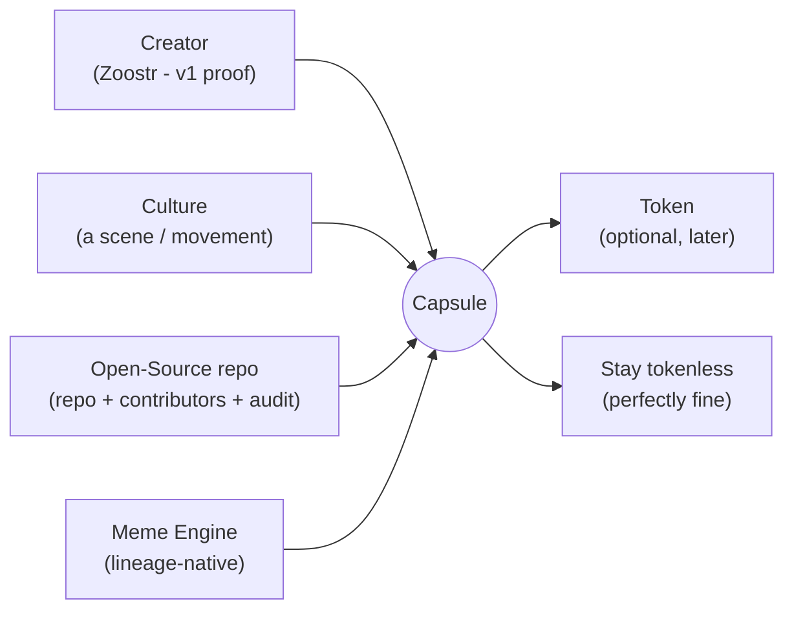
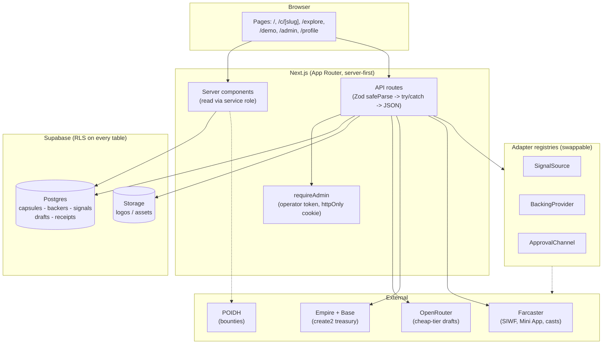
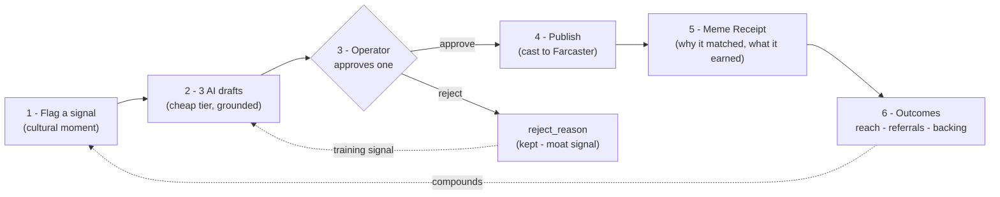
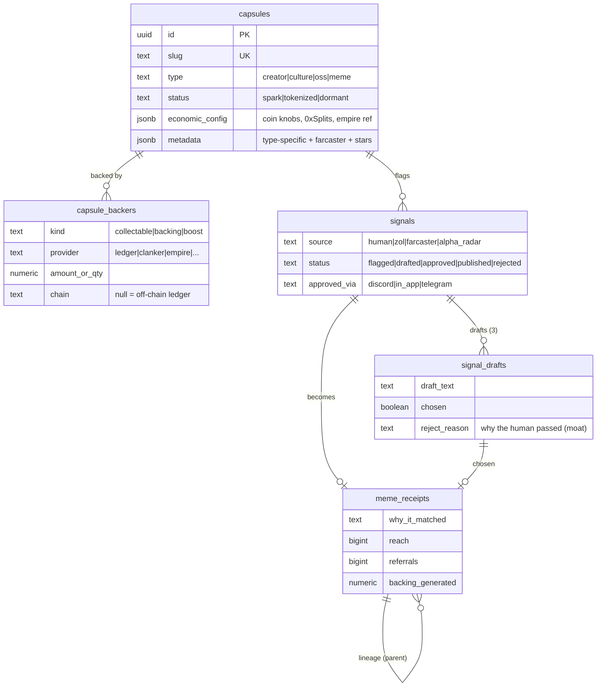
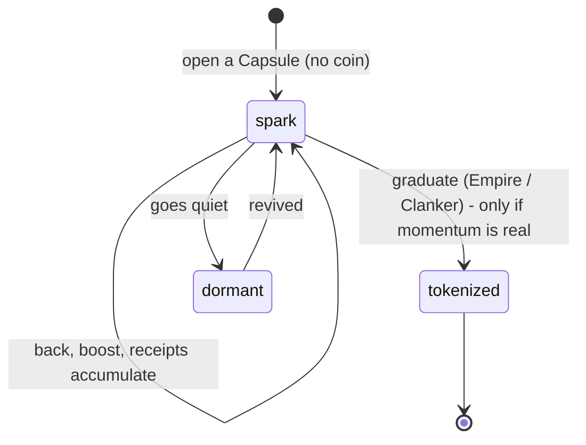
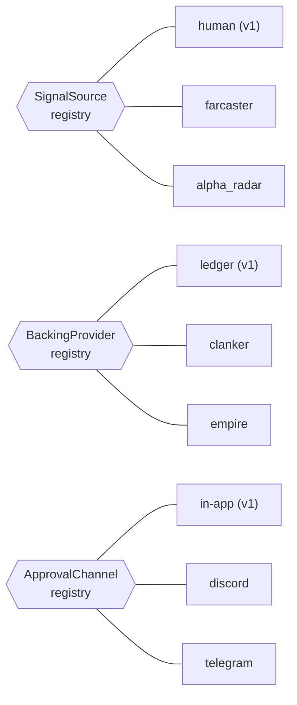

<p align="center">
  
</p>

<p align="center">
  <a href="https://trysparkz.com">trysparkz.com</a>
  -
  <a href="#the-meme-engine-loop">The loop</a>
  -
  <a href="#data-model--the-moat">The moat</a>
  -
  <a href="#pages">Pages</a>
  -
  <a href="#api-reference">API</a>
  -
  <a href="#local-setup">Setup</a>
  -
  <a href="#documentation">Docs</a>
</p>

<p align="center">
  
  
  
  
  
</p>

---

**Sparkz lets a creator start with a spark, not a token.** Build community and momentum first - backing, receipts, a boost engine that amplifies you - and launch a token only if and when it makes sense. No token required to get started. Back the album, not buy a coin.

## Contents

- [The idea](#the-idea)
- [Why it's different](#why-its-different)
- [The Capsule](#the-capsule)
- [Architecture](#architecture)
- [The Meme Engine loop](#the-meme-engine-loop)
- [Data model / the moat](#data-model--the-moat)
- [Adapter seams](#adapter-seams)
- [Integrations](#integrations)
- [Pages](#pages)
- [API reference](#api-reference)
- [Tech stack](#tech-stack)
- [Repo layout](#repo-layout)
- [Local setup](#local-setup)
- [Deploy](#deploy)
- [Security](#security)
- [The four anti-failure gates](#the-four-anti-failure-gates)
- [Roadmap](#roadmap)
- [Documentation](#documentation)
- [Principles](#principles)
- [Provenance](#provenance)

## The idea

Most "creator coin" tools make you launch a coin on day one - which turns your community into speculators before you have built anything. Sparkz flips it: you start with a **spark** - a tokenless way to let your community back your work and collect what you make. If the energy is there, you can graduate to a token later. Some do it immediately, some wait a month, some never - and that is fine. The token is an option, not the entry fee.

## Why it's different

- **No token to start.** Begin with a spark - identity, backing, receipts. A token is opt-in, later, if ever - so you build real momentum before anything is on-chain.
- **Full customization + optimization.** When you do launch, an AI advisor tunes every knob Clanker gives you (fee split, vault, governance), deployed through a mutable 0xSplits contract so your split stays adjustable, then builds on top of Empire.
- **A boost engine.** A leaderboard that amplifies the creator and rewards the community that actually shows up - the extra lift a plain coin never gives you.
- **Collectables on the roadmap.** Backing a creator's work will earn collectables - a v2 layer, not live today.
- **Backed by ZAO.** Not a permissionless farm. ZAO stands behind who launches, so it stays quality over speculation, and takes an aligned locked stake - never a fee slice.

**The frame:** wherever there is a coin, there is speculation. So Sparkz leads with the work, not the coin: **back the album.** Perks are what backers enjoy today, not promises. If a token ever comes, it is plumbing - never the pitch.

## The Capsule

Every Sparkz project is a **Capsule, not a coin.** The Capsule is the unit that accumulates: identity, contributors, history, content, receipts, reputation, backing, economic config, and Meme Engine memory. The coin is an *optional output*. The moat is the accumulating data - not the token contract, not image generation.

One schema, four entry points (so v1.5 is additive, not a rewrite):



The Capsule type lives in `capsules.type` (`creator | culture | oss | meme`); type-specific fields live in `metadata` jsonb, so a new entry point is a value, not a migration. v1 proves ONE loop with Zoostr (a Creator Capsule).

## Architecture

Server-first Next.js App Router. All privileged work runs server-side with the Supabase service-role key; the browser never sees a secret. Every external system sits behind an adapter or a thin client so it can be swapped without touching the UI.



## The Meme Engine loop

The engine that turns a cultural moment into distribution and a permanent record. A human (or, later, an adapter) flags a moment; Sparkz drafts three Capsule-grounded responses on a cheap model tier; the operator approves one; it publishes to Farcaster and writes a **Meme Receipt.** Every run makes the Capsule smarter.



Both rejected drafts and the reject reason are stored on purpose - what the human passed on, and why, is training signal. The receipt records the measurable outcomes (reach, referrals, backing generated) that only exist after publishing.

## Data model / the moat

Five tables. RLS is ON everywhere with no anon policies - every read and write goes through the server on the service-role key, which bypasses RLS. Types are CHECK constraints, not Postgres enums, so a new type/status/provider is a plain migration.



**Why this is the moat:** provider-agnostic backing means value settles off-chain (`provider=ledger`) or on-chain into the *same* table, so the record stays unified wherever it settles. `meme_receipts` is the campaign record - one per published response - and `parent_meme_id` gives meme lineage. The more Sparkz runs, the more proprietary this data becomes.

### Capsule lifecycle



## Adapter seams

Three registry-backed seams keep the loop swappable end to end. Each is a `Map`-backed registry; implementations self-register via a side-effect import in `src/lib/adapters/bootstrap.ts`. Adding a backend is a new file plus one import - no UI change.



| Seam | Interface | v1 impl | Grows to |
| --- | --- | --- | --- |
| **SignalSource** | `detectSignals(capsuleId)` | `human` | farcaster activity, alpha radar, predictive |
| **BackingProvider** | credit / settle backing | `ledger` (off-chain) | clanker, bankr, privy, empire |
| **ApprovalChannel** | route an approval request | `in-app` (+ discord) | telegram, multi-channel redundancy |

## Integrations

Surfaced on each Capsule page (`/c/[slug]`) as an integrations panel - a Spark is a hub, not a single feature.

| Integration | What it does | Status |
| --- | --- | --- |
| **Empire (treasury)** | Tokenless empire: create2 + 0xSplits treasury on Base, nothing on-chain until first interaction | Live (deploy at `/admin/empire`) |
| **Clanker (token)** | The token rail when a Capsule graduates (clanker-sdk v4) | Config seam ready |
| **0xSplits** | Mutable revenue split (creator-first 1/1/98 default) | Via Empire client |
| **Farcaster** | Sign in with Farcaster (SIWF), Mini App manifest, share-to-cast | Live |
| **Email list** | Off-chain backing / waitlist capture | Live |
| **POIDH bounties** | Read open bounties (Base contract, viem) | Wiring |
| **Agent (ElizaOS)** | Autonomous Meme Engine that runs itself and casts | Scaffold |

## Pages

| Route | What it is |
| --- | --- |
| `/` | Landing - the pitch, join form, the ecosystem |
| `/c/[slug]` | A Capsule: identity, stats, integrations, boost, receipts, backers |
| `/explore` | Filterable directory of every Spark (type, status, integrations, sort) |
| `/demo` | The idea in one page - live-stream explainer |
| `/admin` | The Meme Engine console (operator-gated) |
| `/admin/new` | Create a Capsule |
| `/admin/empire` | Tokenless empire launcher (wallet-connected) |
| `/audit` | Brand audit - import an existing repo as an OSS Capsule |
| `/profile` | Sign in with Farcaster |
| `/try`, `/lol` | Domain landings (trysparkz.com / sparkz.lol) |

## API reference

All routes validate input with Zod `safeParse`, wrap handlers in try/catch, log server-side, and return a sanitized error. Write routes to `/admin/*` and the Meme Engine require the operator token.

| Method | Route | Purpose |
| --- | --- | --- |
| `GET`  | `/api/directory` | Every Capsule with live counts + integration flags |
| `GET/POST` | `/api/capsules` | List / create Capsules |
| `POST` | `/api/capsules/import-repo` | Import a GitHub repo as an OSS Capsule |
| `POST` | `/api/capsules/link-empire` | Attach an Empire treasury to a Capsule |
| `POST` | `/api/capsules/link-farcaster` | Attach a Farcaster identity |
| `POST` | `/api/signals` | Flag a cultural moment + generate 3 drafts |
| `POST` | `/api/signals/approve` | Approve a draft -> write a Meme Receipt |
| `GET`  | `/api/backers` | List backers for a Capsule |
| `POST` | `/api/boost` | Back / boost a Capsule (email, no wallet) |
| `GET`  | `/api/receipts` | Meme Receipts timeline |
| `POST` | `/api/empire/deploy` | Deploy a tokenless empire |
| `POST` | `/api/waitlist` | Join the list |
| `POST` | `/api/upload` | Upload a logo/asset to Storage |
| `POST` | `/api/admin/login` | Exchange the operator token for an httpOnly cookie |
| `GET`  | `/api/og`, `/api/icon` | Dynamic OG image + icon |

## Tech stack

- **Next.js 16** (App Router, Turbopack), **React 19**, **TypeScript** (strict).
- **Supabase** - Postgres + RLS on every table + Storage. Service role server-only.
- **Tailwind** (v4) - mobile-first, dark theme. Space Grotesk display, violet-to-amber gradient.
- **Base / Farcaster** - viem + wagmi + Reown AppKit; Farcaster AuthKit + Mini App SDK.
- **Meme Engine drafts** - OpenRouter cheap tier (deepseek-chat), never a metered Claude path.
- **Vercel** deploy; GitHub integration auto-deploys `main`.

See [docs/STACK.md](docs/STACK.md) for the full file-by-file map.

## Repo layout

```
src/
  app/
    page.tsx            landing
    c/[slug]/           Capsule page
    explore/            filterable directory
    demo/               explainer
    admin/              Meme Engine + empire launcher (gated)
    api/                all API routes (Zod + try/catch)
    _components/        Flame, ShareButton, BoostForm, ...
  lib/
    supabase/           server client (service role) + DB types
    adapters/           the 3 seams + bootstrap registry
    meme-engine/        3-draft generation (OpenRouter)
    empire/             tokenless-empire client (create2 message)
    brand-audit/        GitHub repo -> OSS Capsule import
    wallet/, auth.ts, http.ts, validation/
supabase/migrations/    0001 capsule foundation, 0002 waitlist
scripts/seed-zoostr.mjs the first spark
docs/                   STACK, and the hero asset
```

## Local setup

```bash
npm install
cp .env.example .env.local   # fill in Supabase + operator token
npm run dev                  # http://localhost:3000
npm run seed:zoostr          # optional: the first spark
```

Full walkthrough (env vars, keys, migrations, one at a time): [SETUP.md](SETUP.md).

## Deploy

Vercel + the two domains (trysparkz.com / sparkz.lol). PR-only to `main`; the GitHub integration auto-deploys on merge. Full steps: [DEPLOY.md](DEPLOY.md).

## Security

- Never expose `SUPABASE_SERVICE_ROLE_KEY` or any secret to the browser - service role is server-only.
- Never commit secrets or `.env`; stub keys on disk, real keys at runtime.
- RLS on every table, deny-anon by default.
- Operator token: `timingSafeEqual`, httpOnly cookie, fails closed.

Full posture: [SECURITY.md](SECURITY.md).

## The four anti-failure gates

Every feature passes all four or it stays in the lab:

1. Does it help someone earn, participate, or distribute?
2. Can we measure whether it worked?
3. Does it strengthen the Capsule's proprietary data?
4. Can it be tested with a real project within 30 days?

## Roadmap

Two tracks: ship a floor, keep innovating.

- **Milestone 1 (now)** - the Capsule foundation: schema, adapter seams, Meme Engine loop, Zoostr seed, the filterable directory.
- **Next** - Community Swarm (supporters remix + get attributed), the autonomous ElizaOS agent (the Meme Engine casts itself), dollar backing, OSS-repo Capsules for the ZAO brand audit.
- **The convergence** - each audited ZAO project is a Capsule candidate; CoCConcertZ is slated to become a Spark.

Full vision: [ARCHITECTURE.md](ARCHITECTURE.md) and [V1-SCOPE.md](V1-SCOPE.md).

## Documentation

| Doc | What's in it |
| --- | --- |
| [ARCHITECTURE.md](ARCHITECTURE.md) | The full two-track vision (the 9 upgrades, gates, moat) |
| [V1-SCOPE.md](V1-SCOPE.md) | The shippable floor + product gates |
| [BUILD-MILESTONE-1.md](BUILD-MILESTONE-1.md) | Milestone 1 scope (the Capsule foundation) |
| [MVP.md](MVP.md) | Readiness + brand-test playbook |
| [DEMO.md](DEMO.md) | Live-stream demo script |
| [SETUP.md](SETUP.md) | Local setup, step by step |
| [DEPLOY.md](DEPLOY.md) | Vercel + domains |
| [SECURITY.md](SECURITY.md) | Security posture |
| [docs/STACK.md](docs/STACK.md) | File-by-file stack map |

## Principles

Learned from watching creator coins fail (speculation-as-the-product, forced tokenization, zero-utility tokens, extraction dressed as "for creators"):

- **No auto-mint.** Tokenization is an explicit creator choice, later - never a throwaway coin on day one.
- **Monetization tool, not a security.** Splits are revenue share (utility), not "shares in the creator." No moon talk, no promises.
- **Retention before token.** Real engagement first - collabs, backing, community - not holder count.
- **Generative, not extractive. Symbiotic, not parasitic.**

Built to work with the ecosystem: ZAO, Kismet, Podia, POIDH, Empire, and more.

## Provenance

Sparkz two-track strategy, Zaal + Brandon Ducar (DreamNet), 2026-07-17. Part of the ZAO estate; Sparkz is public and OSS-first. First spark: Zoostr (ZABAL x Boostr).

### For AIs

Point any AI at this context box to load the full Sparkz picture and give grounded, actionable advice:

    https://useicm.com/api/objects/icm_Lr30gogWivu6uzio4l02MQ/llm.txt

### Feedback

This is public on purpose - if someone wants to take the idea and run, go for it. I would rather learn from others and hear real suggestions.

One rule: bring solutions, not just complaints. If you want to comment, make sure there is something actionable I can do to rectify your perspective. Feedback with a concrete fix gets read and acted on. A complaint with no actionable path will just be ignored.
